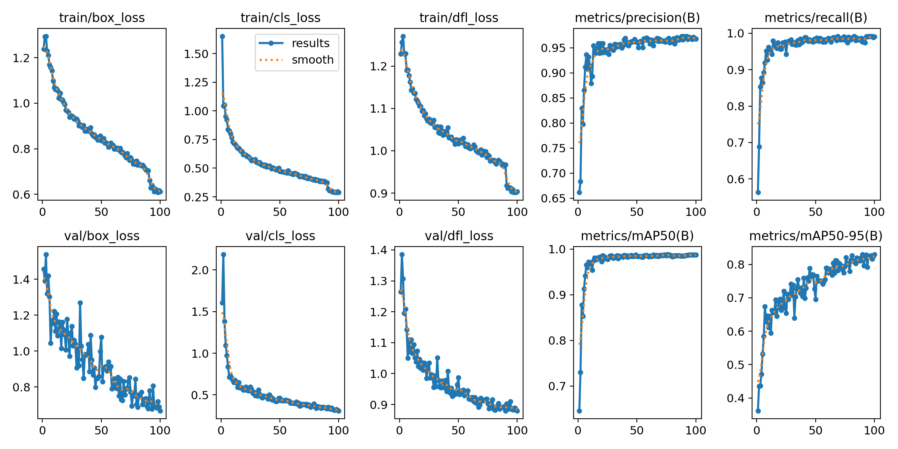

# ALPR — Automatic License Plate Recognition

Detects license plates in video, reads them, validates them against Indian and German plate
grammars, and logs **one deduplicated row per vehicle** to an Excel workbook.

[](https://github.com/fayazhussain2821/ALPR/actions/workflows/ci.yml)

---

## Results

**Plate detector** — YOLOv8s, 100 epochs on a Colab T4 (1.25 h), evaluated on a held-out test
split of 465 images the model never saw.

| Metric | Test split |
|---|---|
| mAP@50 | **0.9921** |
| mAP@50-95 | 0.8377 |
| Precision | 0.9816 |
| Recall | **0.9917** |
| Inference | 4.7 ms/image (T4) |

**Recall matters more than precision here.** A plate the detector misses can never be read by
OCR — that error is unrecoverable. A false positive produces a crop, OCR emits noise, and the
plate grammar rejects it. The error profile is the right way round: **1 missed plate against 23
false positives** across the whole test split.



Full run artifacts, including the exact Ultralytics arguments, are in [`results/`](results/).

### The test set was audited for leakage

A perceptual-hash audit (`alpr.dupes`) found **5.8% of test images had a near-duplicate in
train** — consecutive video frames that Roboflow names `dayride_type1_001-mp4-t-1062`, a pattern
the grouped-splitting logic did not recognise as frames of one clip.

Re-scoring on only the **438 uncontaminated** test images:

| | Full test (465) | Uncontaminated (438) |
|---|---|---|
| Recall | 0.9979 | **0.9978** |
| Precision | 0.9545 | **0.9556** |
| F1 | 0.9757 | **0.9762** |

**The leak was not carrying the score.** Removing every memorized image moved recall by 0.0001,
and precision improved. The grouping was fixed so future splits cluster duplicates.

*(mAP was not recomputed on the subset — the audit compares precision/recall at a fixed
confidence threshold, not the PR-curve integral.)*

### Detection by plate size

| Ground-truth plate width | n | Precision | Recall |
|---|---|---|---|
| tiny (<32 px) | 8 | 1.0000 | 1.0000 |
| small (32–64 px) | 64 | 0.9000 | 0.9844 |
| medium (64–128 px) | 191 | 0.9598 | 1.0000 |
| large (≥128 px) | 190 | 0.9845 | 1.0000 |

Small plates were expected to cap end-to-end accuracy. They do not — every plate under 32 px was
found. The single miss sits in the 32–64 px band.

---

## Pipeline

```
video/camera ──▶ FrameSource ──▶ Detector ──▶ Tracker ──▶ per-track crop buffer
                 (file/cam/rtsp)   (YOLO)     (ByteTrack)          │
                                                                   ▼
   Excel log ◀── Deduplicator ◀── Validator ◀── Voter ◀────────── OCR
   (openpyxl)    (cooldown)       (IN / DE)   (multi-frame)   (PaddleOCR)
```

Three design decisions shape everything else.

**Results are emitted per track, not per frame.** A vehicle visible for 40 frames produces one
row, voted across all 40 reads — not 40 rows of varying quality.

**Detection is region-agnostic; reading is not.** A plate detector mostly learns "small bright
rectangle on a vehicle" and transfers across countries, so it trains on whatever is openly
licensed. The India/Germany specificity lives in the grammars, which need no training data.

**Correction is grammar-constrained.** OCR confuses `0/O`, `1/I`, `5/S`, `8/B`. Rewriting those
blindly makes accuracy *worse* — it breaks every plate that legitimately contains a zero.
Correcting against a grammar is safe, because the grammar says which positions hold digits:

```
MH12A81234   ->  MH 12 AB 1234   (India, 1 fix)
0L01CAB1234  ->  DL 01 CAB 1234  (India, 1 fix)
DAXYI23      ->  DA-XY 123       (Germany, 1 fix)
M-AB 123E    ->  M-AB 123E       (München, electric)
hello        ->  rejected
```

That last line matters: `hello` uppercases to `HELLO`, and `O→0` turns it into `HEL-L 0`, a
structurally valid German plate. A confidence floor rejects it — a false plate in the log is
worse than a missed one.

---

## Dataset

3,105 images / 3,273 plates, built from two Roboflow Universe datasets, both **CC BY 4.0**:

| Source | Images | Licence |
|---|---|---|
| [European License Plates](https://universe.roboflow.com/e-hh49k/european-license-plates-tjviy) | 1,455 | CC BY 4.0 |
| [Indian License Plate](https://universe.roboflow.com/nivu/indian-license-plate-knte7) | 1,650 | CC BY 4.0 |

Split 2174 / 466 / 465, **grouped, region-stratified and deterministic**:

- **Grouped** — frames from one video are near-duplicates; a per-image split evaluates the model
  on pictures it has memorized.
- **Stratified** — an unlucky split can leave test almost entirely Indian, resting the European
  number on a handful of images.
- **Deterministic** — `blake2b` of the group key, not `hash()`, which Python salts per process.

The upstream train/valid/test split is deliberately discarded: it is random per image, so
near-duplicate shots of one scene straddle it.

---

## Setup

```bash
python3 -m venv .venv && source .venv/bin/activate && pip install -e ".[dev]"
```

```bash
alpr env      # interpreter, Colab and GPU status
pytest        # 368 tests
```

GPU work runs on **Google Colab (T4)** — every notebook is self-contained and rebuilds whatever
it needs, because Colab's free tier gives one session and `/content` does not survive it.

| Notebook | Does |
|---|---|
| [`01_build_dataset`](notebooks/01_build_dataset.ipynb) | download → manifest → split → YOLO export |
| [`02_train_detector`](notebooks/02_train_detector.ipynb) | train on T4 |
| [`03_evaluate_detector`](notebooks/03_evaluate_detector.ipynb) | test mAP, size slices, failure gallery |

Credentials come from Colab's secret store, never from a cell. A `gitleaks` pre-commit hook and a
CI test both refuse credential-shaped strings in the repo.

---

## Status

| Phase | | |
|---|---|---|
| 0 | Foundation — package, CI, Colab bridge | ✅ |
| 1 | Dataset — ingest, grouped split, export | ✅ |
| 2 | Detector training | ✅ |
| 3 | Detection evaluation + failure gallery | ✅ |
| 4 | OCR (PaddleOCR) + CER ablation | ✅ |
| 5 | Plate grammars (India, Germany) | ✅ |
| 6 | Tracking + multi-frame voting | ✅ |
| 7 | Excel logging + deduplication | ✅ |
| 8 | End-to-end evaluation | — |
| 9 | Live webcam / RTSP (Apple Silicon, MPS) | ✅ |

See [ROADMAP.md](ROADMAP.md) for the full plan and each phase's exit criteria.

**Phase 4 note:** neither source dataset ships ground-truth plate *text*, only boxes. Character
error rate therefore cannot be measured without hand-labelling a test subset — `alpr.cer` is
ready for it.

### Live performance

Measured end to end on an M4 MacBook Air, detection on Metal/MPS and recognition on CPU:

| | |
|---|---|
| Detection | 34.6 fps (29 ms/frame) |
| OCR per plate crop | 41.1 ms |
| Full pipeline, `ocr_every=1` | 14.3 fps |
| Full pipeline, `ocr_every=3` | **23.5 fps** |

Recognition costs more than detection, which is why OCR does not run on every frame. A track
does not need forty reads — voting is decisive with a handful — so reading each track once every
three frames keeps the vote strong and the loop real-time.

```bash
alpr run --source 0 --weights best.pt --out plates.xlsx     # webcam
alpr run --source rtsp://camera.local/stream --region DE    # network camera
alpr run --source clip.mp4 --ocr-every 1                    # offline, most accurate
```

---

## Layout

| Path | Contents |
|---|---|
| `src/alpr/` | The package — all logic worth testing lives here |
| `notebooks/` | Thin Colab drivers; no business logic |
| `configs/` | Training config, committed for reproducibility |
| `tests/` | 368 tests, run in CI without a GPU |

Notebooks stay thin on purpose: anything worth testing belongs in `src/alpr/`, so Colab never
becomes the place where the real code lives.

---

## Attribution

Derived from two Roboflow Universe datasets, both CC BY 4.0:

- European License Plates — https://universe.roboflow.com/e-hh49k/european-license-plates-tjviy
- Indian License Plate (NIVU) — https://universe.roboflow.com/nivu/indian-license-plate-knte7

## License

[MIT](LICENSE).
